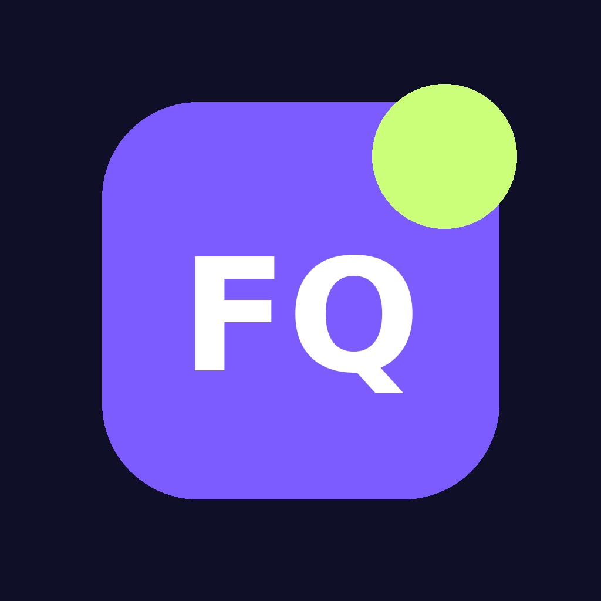
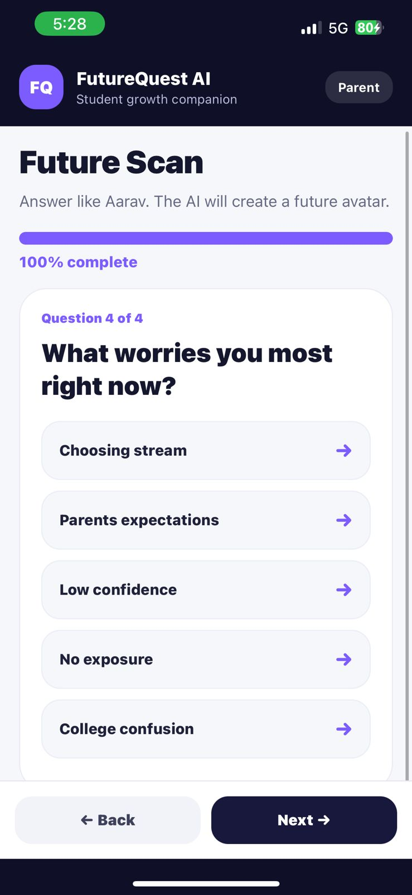
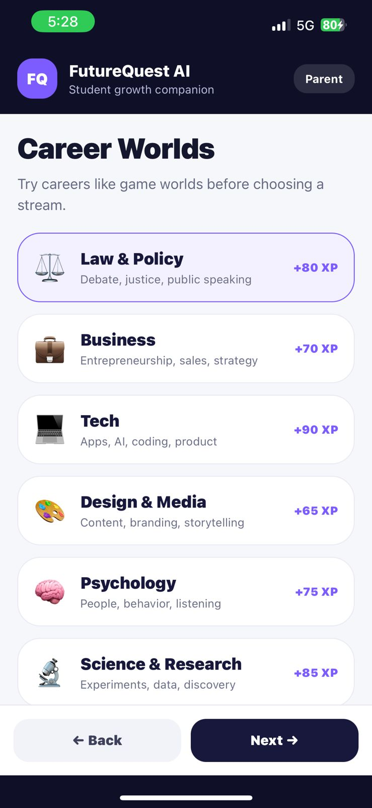
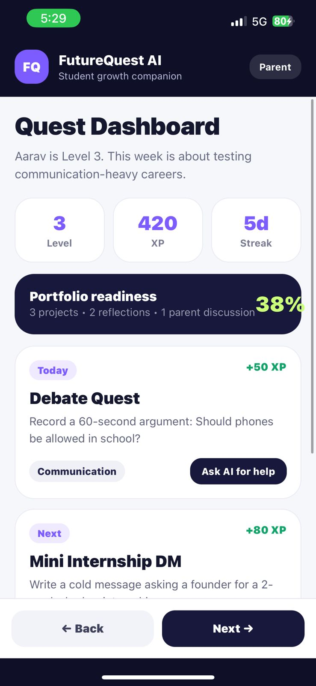
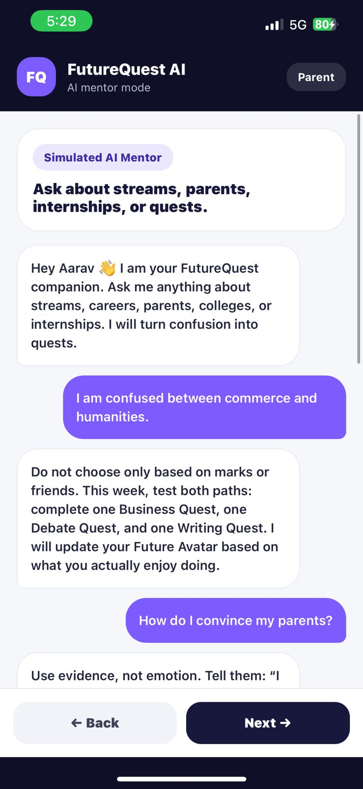
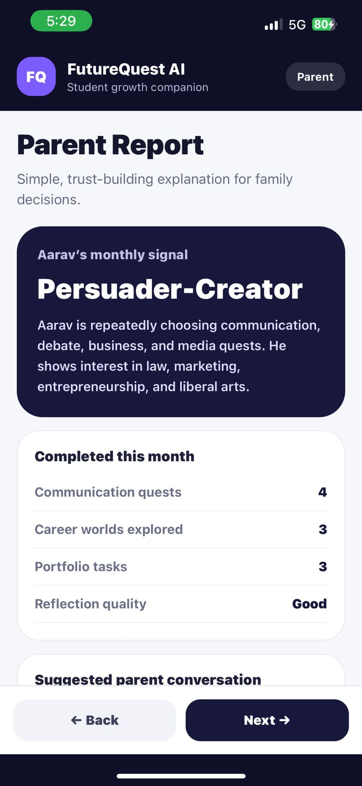
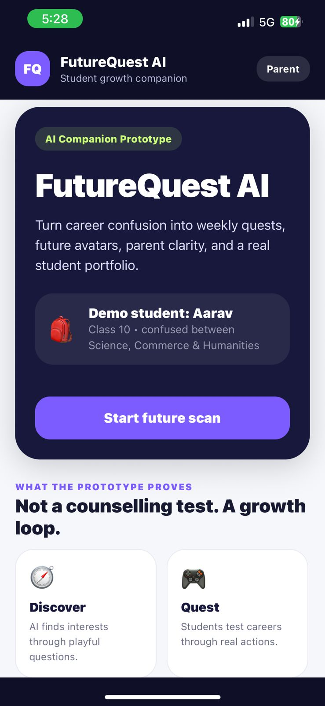

<p align="center">
  
</p>

<h1 align="center">FutureQuest AI</h1>

<p align="center">
  From career confusion to a college-ready profile—safely.
</p>

<p align="center">
  Expo 54 · React Native 0.81 · TypeScript 5.9
</p>

FutureQuest AI is a mobile product prototype for Indian students in Classes 8–12. It turns career uncertainty into a practical loop: discover interests, try real-world quests, reflect with an AI companion, share progress with parents, and build evidence of growth.

This repository contains the original working prototype source, the final revised pitch deck, the assignment brief, a demo video, and the Android APK.

## Project materials

| Material | Link |
| --- | --- |
| Demo video | [Watch the prototype flow](demo/FutureQuest_Demo.mp4) |
| Final presentation | [Open the 20-slide revised deck](pitch-deck/FutureQuest_AI_Presentation_Revised.pptx) |
| Android APK | [Download the prototype APK](releases/FutureQuestAIByAdityaDar.apk) |
| Original brief | [Read the AI Companion brief](docs/FutureQuest_AI_Companion_Brief.pdf) |
| Architecture | [See the screen flow and technical notes](docs/architecture.md) |

## Prototype preview

| Future Scan | Career Worlds | Quest Dashboard |
| --- | --- | --- |
|  |  |  |

| AI Companion | Parent Report | Welcome |
| --- | --- | --- |
|  |  |  |

## What the prototype demonstrates

- A playful four-question **Future Scan**
- A generated **Future Avatar** with suggested paths, strengths, and a growth edge
- Six explorable **Career Worlds**
- Action-oriented **Weekly Quests** with skills and XP
- A reliable, scripted **AI Companion** demo with quick prompts
- A **Parent Report** showing progress, interests, and suggested next steps
- A seven-screen mobile journey designed for a clear product pitch

## Product vision versus implemented prototype

The app implements the core student journey and parent-report demo. The presentation also explains the wider product vision: verified experience ratings, parent approvals and daily reports, privacy-by-design for minors, safe question answering without open chat, and a CommonApp-style student profile for colleges and opportunities.

Those wider trust, community, application, and data systems are product concepts in this version; they are not production backend features yet.

## Run locally

### Prerequisites

- Node.js LTS
- npm
- Expo Go on a phone, or an Android/iOS emulator

### Install and start

```bash
npm ci
npm start
```

Then scan the Expo QR code or choose a platform from the Expo terminal.

Useful commands:

```bash
npm run android
npm run web
npm run build:apk
```

The APK build command uses the `preview` profile in `eas.json` and requires an Expo/EAS account.

## Prototype flow

1. Meet Aarav, the Class 10 demo student.
2. Complete the Future Scan.
3. Review the generated Future Avatar.
4. Explore Career Worlds.
5. Open the Quest Dashboard.
6. Ask the scripted AI Companion a career question.
7. Review the Parent Report.

## Repository structure

```text
futurequest-ai/
├── App.tsx                    # Original seven-screen prototype
├── index.ts                   # Expo entry point
├── app.json                   # Expo application configuration
├── eas.json                   # Android build profiles
├── package.json               # Scripts and pinned dependencies
├── package-lock.json          # Reproducible npm dependency lock
├── assets/                    # Original app icons and splash assets
├── demo/                      # Product demo video
├── docs/                      # Brief, original notes, and architecture
├── pitch-deck/                # Final revised PowerPoint
└── releases/                  # Built Android APK
```

## Technical notes

- The prototype is intentionally contained in `App.tsx` for demo portability.
- Navigation is state-driven and does not require a navigation library.
- AI responses are scripted for a predictable live pitch.
- No backend, authentication, database, analytics, or data persistence is included.
- No API keys or secrets are required.
- Student inputs remain in memory and reset when the app restarts.

See [docs/architecture.md](docs/architecture.md) for the detailed flow and recommended production evolution.

## Source integrity

The application source and supplied project artifacts were copied without modification. SHA-256 hashes are recorded in [checksums.sha256](checksums.sha256). The prototype's original README is preserved at [docs/original-prototype-readme.md](docs/original-prototype-readme.md).

## Safety and privacy

This is a product prototype, not a production service for minors. A real deployment would require age-appropriate consent, parent/guardian controls, data minimization, access control, moderation, secure retention policies, and legal review. See [SECURITY.md](SECURITY.md).

## Author

**Aditya Dar**  
2022A4PS0026P

## License

Shared for portfolio and evaluation purposes. See [LICENSE](LICENSE).
